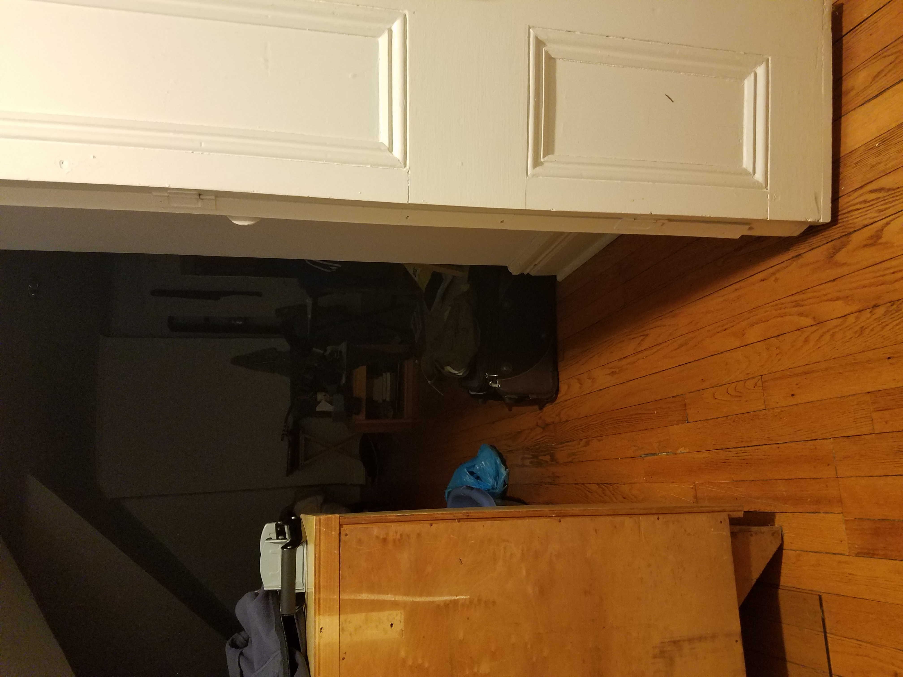
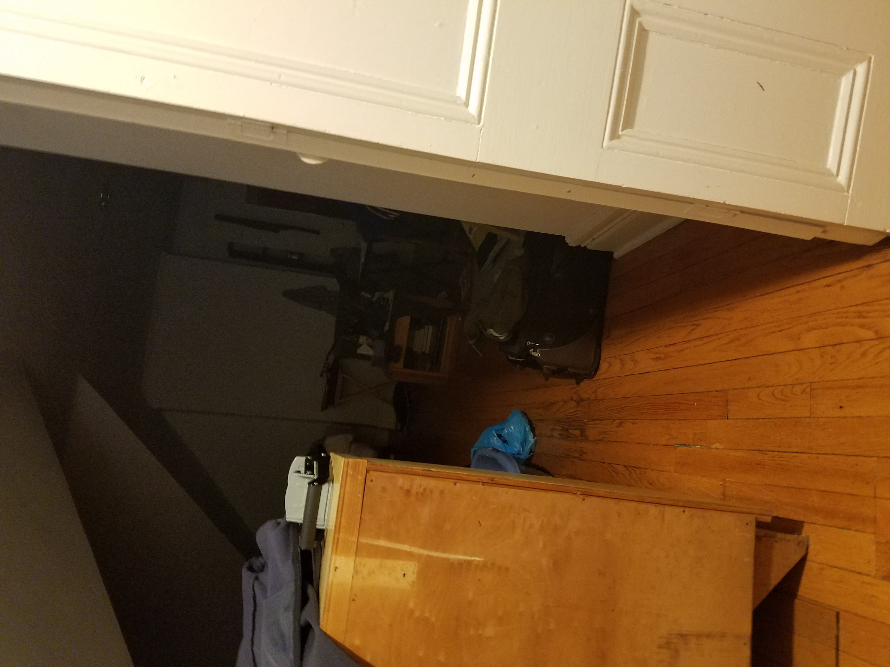

# Super-Image-Resolution
Generating Super Resolution Images with image calibration. ECE 4250 Final Project 

## Task was to gain information of a scene by using many images

Took 7 pictures of my room, and registered the images in MATLAB, interpolated, added and averaged the images using some transformation matrices. 

Here are the two room images calibrated.

